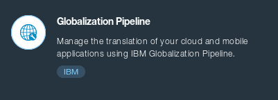

Globalization Pipeline Common Files
===================================

This repo contains common files for the 
[IBM Globalization Pipeline](https://www.ng.bluemix.net/docs/#services/GlobalizationPipeline/index.html) SDK projects.

DOWNLOAD
--------

There are a number of SDKs available for this service.

* Python: [SDK](https://github.com/IBM-Bluemix/gp-python-client)
* Java: [SDK](https://github.com/IBM-Bluemix/gp-java-client) | [Tools](https://github.com/IBM-Bluemix/gp-java-tools)
* Angular: [SDK](https://github.com/IBM-Bluemix/gp-angular-client)
* Node.js: [SDK](https://github.com/IBM-Bluemix/gp-js-client) | [Sample](https://github.com/IBM-Bluemix/gp-nodejs-sample)
* Cordova: [SDK](https://github.com/IBM-Bluemix/gp-cordova-plugin)
* Ruby: [SDK](https://github.com/IBM-Bluemix/gp-ruby-client) | [Sample](https://github.com/IBM-Bluemix/gp-ruby-sample)
* Urban Code Deploy: [Plugin](https://github.com/IBM-Bluemix/gp-ucd-plugin)

CONTRIBUTING
------------
see [CONTRIBUTING.md](CONTRIBUTING.md)

LICENSE
-------
Apache 2.0. See [LICENSE.txt](LICENSE.txt)

> Licensed under the Apache License, Version 2.0 (the "License");
> you may not use this file except in compliance with the License.
> You may obtain a copy of the License at
> 
> http://www.apache.org/licenses/LICENSE-2.0
> 
> Unless required by applicable law or agreed to in writing, software
> distributed under the License is distributed on an "AS IS" BASIS,
> WITHOUT WARRANTIES OR CONDITIONS OF ANY KIND, either express or implied.
> See the License for the specific language governing permissions and
> limitations under the License.
